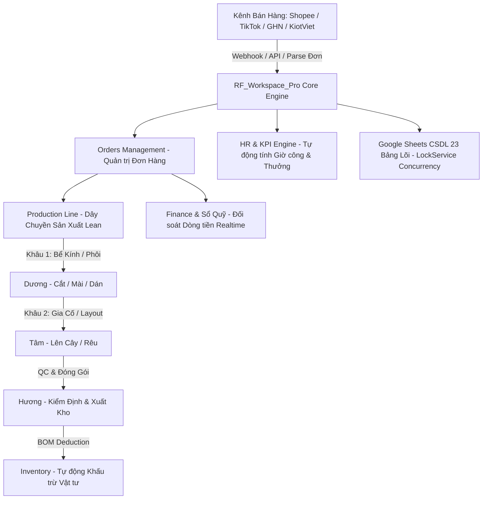

# 🐟 RF_WORKSPACE_PRO — Enterprise Operating System & ERP
> **Hệ thống Quản trị Vận hành, Sản xuất Lean & Đối soát Đa kênh cho Rich Fish Aquarium**

[](https://developers.google.com/apps-script)
[](https://reactjs.org/)
[](https://docs.google.com)
[](#)
[](CHANGELOG.md)

---

## 📌 Giới thiệu tổng quan (Overview)

`RF_Workspace_Pro` là nền tảng điều hành tập trung toàn bộ chuỗi giá trị của **Rich Fish Aquarium**, từ tiếp nhận đơn hàng đa kênh (Shopee VN, Shopee Global, TikTok Shop, GHN, KiotViet, Bán lẻ), điều phối dây chuyền sản xuất theo triết lý **Lean Manufacturing (One-Piece Flow & Takt Time 2h)**, khấu trừ vật tư tự động (BOM), đến đối soát dòng tiền và tính lương KPI tự động theo thời gian thực.

---

## 🏗️ Kiến trúc Hệ thống (System Architecture)



---

## 🧩 Các Module Tính Năng Chính (Core Modules)

| Module | Tệp Giao Diện / Mã Nguồn | Chức Năng Chính |
| :--- | :--- | :--- |
| **📦 Đơn Hàng (Orders)** | `Tab_Orders.html`, `Modals_Orders.html` | Tiếp nhận đơn đa kênh, định danh trạng thái chuẩn, đối soát doanh thu, phân bổ giao vận. |
| **⚙️ Sản Xuất (Production)** | `Tab_Production.html` | Điều phối lệnh sản xuất Khâu 1 ➡️ Khâu 2 ➡️ QC ảnh ➡️ Đóng gói. Chống nghẽn dòng chảy (Muda). |
| **🏭 Kho & BOM (Inventory)** | `Tab_Inventory.html`, `Tab_ImportExport.html` | Quản lý SKU, cảnh báo tồn kho tối thiểu (`minStock`), khấu trừ vật tư tự động theo `BOM_Config`. |
| **👥 Nhân Sự & KPI (HR)** | `Tab_HR.html` | Chấm công GPS, tính lương cơ bản/phụ cấp, đo lường KPI tự động theo đơn hoàn thành. |
| **💰 Tài Chính & Sổ Quỹ** | `Tab_Finance.html`, `Tab_Affiliate.html` | Dòng tiền thu/chi, ví Shopee/TikTok, công nợ nhà cung cấp, chiết khấu hoa hồng CTV. |
| **🌏 Shopee Global Hub** | `Shopee*.js`, `ShopeeGlobalTab.html` | Đồng bộ API Shopee V2, quản lý thị trường Quốc tế (TH, SG, MY, PH, TW), Webhook relay. |
| **📊 Báo Cáo & Phân Tích** | `Tab_Analytics.html`, `Tab_BusinessReport.html` | Báo cáo P&L đa kênh, biểu đồ doanh thu thuần, tỷ lệ hàng hoàn, hiệu suất thợ. |
| **🧊 Mô Hình 3D & Tài Liệu** | `Tab_Viewer3D.html`, `Tab_Documents.html` | Xem trước layout bể kính 3D tương tác, cẩm nang đào tạo và quy trình vận hành SOP. |

---

## 🗄️ Cấu trúc Cơ sở Dữ liệu Lõi (23 Schema Tables)

Hệ thống lưu trữ và đồng bộ quan hệ chặt chẽ trên Google Sheets với 23 bảng cốt lõi:

1. **`Orders`**: Mã đơn, kênh bán, khách hàng, deadline, trạng thái, phụ kiện, doanh thu, COGS, phí sàn, đối soát.
2. **`Production`**: Lệnh sản xuất, tiến độ Khâu 1 (`p1_*`), Khâu 2 (`p2_*`), QC ảnh (`qc_*`), thưởng khoán.
3. **`Packings`**: Nhật ký đóng gói, ảnh chụp trước/sau kiện hàng, thưởng đóng gói.
4. **`Products`**: Danh mục SKU, giá vốn, giá bán, số lượng tồn, định mức tồn an toàn (`minStock`/`maxStock`).
5. **`Config_NhanSu`**: Danh sách nhân sự, phân quyền, PIN, lương cơ bản, phụ cấp xăng xe, mức phạt.
6. **`Attendance`**: Dữ liệu chấm công vào/ra (sáng/chiều), ca kíp, tổng giờ làm việc, trạng thái duyệt.
7. **`KPI_Progress`**: Tiến độ chỉ tiêu KPI tự động từng nhân sự theo chu kỳ.
8. **`Config_KPI`**: Bảng định mức thời gian và tiền thưởng khoán Khâu 1, Khâu 2, Đóng gói, Chở kho.
9. **`BOM_Config`**: Định mức tiêu hao nguyên vật liệu cho từng mã Layout/Bể kính.
10. **`Transactions`**: Sổ quỹ thu / chi / chuyển tiền nội bộ.
11. **`ImportExport`**: Phiếu nhập/xuất kho vật tư và thành phẩm.
12. **`Accounts`**: Danh sách tài khoản ngân hàng, ví sàn TMĐT và số dư khả dụng.
13. **`BonusPenalty`**: Nhật ký thưởng / phạt / tạm ứng nhân sự gắn liền với mã đơn.
14. **`CTV_Finance`**: Bảng kê hoa hồng và thanh toán cộng tác viên.
15. **`Config_GiaLayout`**: Bảng hệ số tính giá layout theo kích thước và độ chi tiết.
16. **`Documents`**: Kho tài liệu, quy chế và quy trình vận hành chuẩn (SOP).
17. **`Trainings`**: Khóa học nội bộ và kiểm tra kiến thức nhân sự.
18. **`Models3D`**: Danh mục file 3D Layout bể kính trực quan.
19. **`Monthly_Snapshots`**: Bản chụp chốt sổ lương, công nợ và giờ công hàng tháng.
20. **`ProfitReports`**: Báo cáo lợi nhuận tổng hợp theo từng kênh bán hàng.
21. **`Reimbursements`**: Đề xuất hoàn ứng chi phí nội bộ có gắn mã QR thanh toán.
22. **`Suppliers`**: Danh bạ nhà cung cấp kính, lũa, đá, phụ kiện và theo dõi công nợ.
23. **`Tracking_Log`**: Nhật ký vận hành hệ thống, bẫy lỗi và truy vết thao tác.

---

## ⚡ Nguyên Tắc Phát Triển & Kỷ Luật Code (Engineering Discipline)

- **LockService Concurrency**: Tất cả các hàm ghi/sửa dữ liệu trên Google Apps Script (`Code.js`) bắt buộc được bọc trong `LockService.getScriptLock().waitLock(15000)` để ngăn ngừa xung đột dữ liệu (Race Condition).
- **Optimistic UI & Delta Sync**: Frontend phản hồi tức thì với thao tác người dùng và tự động đồng bộ ngầm sai phân dữ liệu với backend.
- **Exact Match Rule**: Chuẩn hóa tuyệt đối trạng thái đơn hàng khi đối soát TMĐT:
  - `"Hoàn thành"` / `"Completed"` ➡️ `"Đối Soát Thành Công"`
  - `"Đã giao"` / `"Delivered"` ➡️ `"Đã Bàn Giao"`
  - `"Trả hàng/Hoàn tiền"` / `"Returned"` ➡️ `"Hàng Hoàn"`
  - `"Đã hủy"` / `"Cancelled"` ➡️ `"Đơn Huỷ"`
  - Khác ➡️ `"Chờ Sản Xuất"`

---

## 🚀 Hướng Dẫn Đồng Bộ Code (Git Sync Workflow)

Hệ thống được cấu hình `.gitignore` sạch 100%, tự động loại bỏ rác cache và các file dữ liệu nặng:

```bash
# 1. Lưu toàn bộ thay đổi
git add .

# 2. Commit với thông điệp chuẩn hóa
git commit -m "feat: nội dung cập nhật mới"

# 3. Đẩy lên nhánh chính
git push origin main
```

---

## 📄 Bản quyền & Bảo mật (License)
Bản quyền thuộc về **Rich Fish Aquarium** © 2026. Mọi quyền được bảo lưu. Toàn bộ mã nguồn và cấu trúc CSDL phục vụ mục đích vận hành nội bộ độc quyền.
